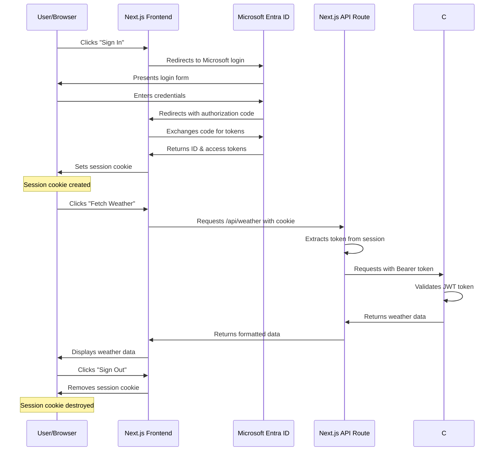

# Authentication Flow Documentation

This document explains the complete authentication flow in our application, from the client browser through Next.js, to the C# backend API, and back.

## Overview

Our application uses Microsoft Entra ID (formerly Azure AD) for authentication with OAuth 2.0 and OpenID Connect protocols. The flow involves several components:

1. **Client Browser**: Where the user initiates authentication and makes requests
2. **Next.js Frontend**: Handles authentication UI and token management
3. **Next.js API Routes**: Acts as a secure proxy between frontend and backend
4. **C# Backend API**: Validates tokens and serves protected data

## Authentication Flow Diagram



## Detailed Authentication Process

### 1. Initial Sign-In

1. **User Initiates Authentication**:

   - User clicks "Sign In with Microsoft" button
   - Frontend calls `signIn('microsoft-entra-id')` from next-auth

2. **Redirect to Identity Provider**:

   - Next.js redirects to Microsoft Entra ID authorization endpoint
   - Required parameters are sent (client_id, redirect_uri, scope, etc.)

3. **User Authentication**:

   - User logs in with Microsoft credentials
   - Microsoft may prompt for additional consent if required

4. **Authorization Code Return**:

   - Microsoft redirects back to the application's callback URL
   - Authorization code is included in the redirect

5. **Token Exchange**:

   - Next.js (via NextAuth.js) exchanges the code for tokens
   - This includes ID token, access token, and refresh token
   - Exchange happens server-side via secure channel

6. **Session Creation**:
   - NextAuth creates a session including user information
   - Access token is stored in session JWT (encrypted)
   - Session token is set as an HTTP-only cookie in the browser
   - Cookie name: `next-auth.session-token` or `__Secure-next-auth.session-token` (in HTTPS)
   - Cookie contains encrypted JWT with user info and tokens

### 2. Protected API Request Flow

1. **Client Request**:

   - Authenticated user clicks "Fetch Weather"
   - Frontend JavaScript makes fetch request to `/api/weather`
   - Session cookie is automatically included by the browser

2. **Next.js API Route**:

   ```typescript
   // api/weather/route.ts
   export async function GET(req: NextRequest) {
     // Extract JWT token from the request's cookies
     const token = await getToken({ req, secret: process.env.AUTH_SECRET });
     const accessToken = token?.accessToken as string | undefined;

     // Check authentication
     if (!token || !accessToken) {
       return NextResponse.json(
         { message: 'Not authenticated' },
         { status: 401 }
       );
     }

     // Forward request to backend with token
     const response = await fetch(`${backendApiUrl}/weatherforecast`, {
       headers: {
         Authorization: `Bearer ${accessToken}`,
       },
     });

     // Return data to frontend
     const data = await response.json();
     return NextResponse.json(data);
   }
   ```

3. **Token Validation in C# Backend**:

   ```csharp
   // Backend controller with [Authorize] attribute
   [ApiController]
   [Route("[controller]")]
   [Authorize]  // Requires valid JWT
   public class WeatherForecastController : ControllerBase
   {
       [HttpGet]
       public IEnumerable<WeatherForecast> Get()
       {
           // Only executes if token is valid
           var forecast = // generate forecast data...
           return forecast;
       }
   }
   ```

4. **Response Path**:
   - C# API validates the JWT token using Microsoft identity platform
   - If valid, weather data is returned
   - If invalid, 401 Unauthorized response is returned
   - Next.js API route forwards the response to the frontend
   - Frontend displays the data or error message

### 3. Sign Out Process

1. **User Initiates Sign Out**:

   - User clicks "Sign Out" button
   - Frontend calls `signOut()` from next-auth

2. **Session Termination**:

   - NextAuth.js removes the session cookie from the browser
   - Cookie is immediately invalidated
   - Browser will no longer send the session cookie with requests
   - User returns to unauthenticated state

3. **Session Cookie Lifecycle**:
   - Creation: Set during successful authentication
   - Usage: Sent with every request to protected routes
   - Destruction: Removed during sign out or on expiration
   - Security: HTTP-only flag prevents JavaScript access to the cookie content

### 4. Unauthorized Access Testing

The application includes a "Test Fetch Weather" button for non-authenticated users to verify API protection:

1. User clicks "Test Fetch Weather" without being signed in
2. Request goes to Next.js API route without a valid session cookie
3. API route detects missing/invalid token and returns 401
4. Frontend displays the authentication error

## Session Cookie Details

The application UI displays the session cookie status to demonstrate the authentication mechanism:

1. **When Signed In**:

   - Shows that the session cookie is present
   - Option to view the cookie's name and encrypted value
   - Session cookie is used to maintain authenticated state

2. **When Signed Out**:

   - Shows that no session cookie is present
   - Normal for unauthenticated state

3. **Cookie Properties**:
   - **Name**: `next-auth.session-token` or `__Secure-next-auth.session-token` (in HTTPS)
   - **HttpOnly**: True (prevents JavaScript access to cookie value)
   - **Secure**: True in production (only sent over HTTPS)
   - **SameSite**: Lax (prevents CSRF attacks while allowing normal navigation)
   - **Path**: / (available throughout the application)
   - **Max-Age/Expires**: Configured session duration (default: 30 days)

## Security Considerations

1. **Token Storage**:

   - Access tokens never exposed to client JavaScript
   - Tokens stored server-side in encrypted session cookie
   - Session cookie has HttpOnly flag to prevent client-side access

2. **Token Validation**:

   - Tokens validated by both Next.js API routes and C# backend
   - Multiple layers of protection

3. **HTTPS**:

   - All communication happens over HTTPS
   - Prevents token interception

4. **Token Lifetime**:
   - Access tokens have limited lifetime
   - Refresh tokens used for silent renewal when possible
   - Session cookie has its own expiration

## Environment Configuration

The authentication flow requires proper configuration of environment variables:

```env
# Microsoft Entra ID Configuration
AUTH_MICROSOFT_ENTRA_ID_ID=client_id
AUTH_MICROSOFT_ENTRA_ID_SECRET=client_secret
AUTH_MICROSOFT_ENTRA_ID_TENANT_ID=tenant_id

# Backend API configuration
API_BASE_URL=http://localhost:5229

# NextAuth Secret (for encrypting cookies)
AUTH_SECRET=your_secure_random_string
```

## Testing Authentication Protection

To verify the authentication protection is working:

1. Sign out or use an incognito window
2. Observe that no session cookie is present
3. Click the "Test Fetch Weather" button
4. Observe the 401 Unauthorized error
5. Sign in with a valid account
6. Observe that the session cookie is created
7. Try the "Fetch Weather" button again
8. Observe successful data retrieval
9. Sign out
10. Observe that the session cookie is destroyed
