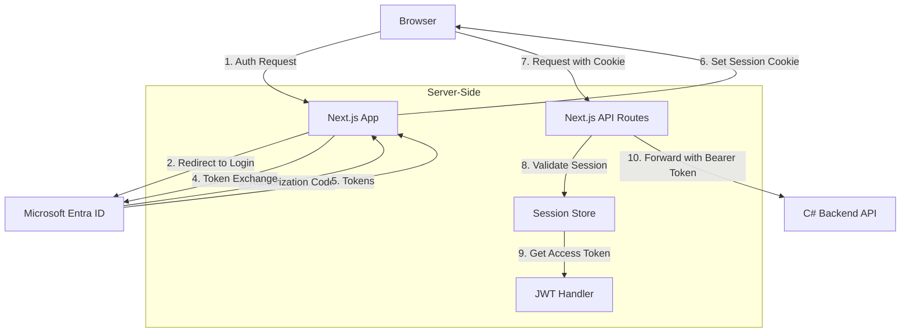

# Next.js Auth.js Implementation Guide

This document explains how Auth.js (formerly NextAuth.js) is implemented in our Next.js application.

## Overview

Auth.js provides a complete authentication solution for Next.js applications, handling:

1. **Authentication Providers**: Integration with identity providers (Microsoft Entra ID in our case)
2. **Token Management**: Securely storing and refreshing OAuth/OIDC tokens
3. **Session Handling**: Creating and maintaining user sessions
4. **API Protection**: Securing API routes

## Implementation Architecture

Unlike traditional cookie-based authentication libraries common in ASP.NET, Auth.js uses a combination of techniques:

- HTTP-only cookies for session management
- JWT tokens for API authentication
- Server-side session validation



## Core Components

### 1. Auth.js Configuration (Server-Side)

This is defined in a file called `auth.ts` (or similar) and sets up the entire authentication system:

```typescript
// apps/frontend/auth.ts (simplified)
import NextAuth from 'next-auth';
import EntraId from 'next-auth/providers/azure-ad';

export const { handlers, auth, signIn, signOut } = NextAuth({
  providers: [
    EntraId({
      clientId: process.env.AUTH_MICROSOFT_ENTRA_ID_ID,
      clientSecret: process.env.AUTH_MICROSOFT_ENTRA_ID_SECRET,
      tenantId: process.env.AUTH_MICROSOFT_ENTRA_ID_TENANT_ID,
      authorization: {
        params: {
          scope: 'openid profile email User.Read offline_access',
        },
      },
    }),
  ],
  callbacks: {
    // This is like middleware for the auth process
    jwt: async ({ token, account }) => {
      // Store tokens in the JWT when we get them
      if (account) {
        token.accessToken = account.access_token;
        token.refreshToken = account.refresh_token;
        token.expiresAt = account.expires_at;
      }

      // Token rotation logic would go here (similar to refresh token handling in C#)
      return token;
    },
    session: async ({ session, token }) => {
      // Pass tokens to the session (never exposed to client)
      session.accessToken = token.accessToken;
      return session;
    },
  },
  session: {
    strategy: 'jwt', // Store session data in JWT (encrypted in cookie)
    maxAge: 30 * 24 * 60 * 60, // 30 days
  },
});
```

### 2. Session Token Storage (HTTP-only Cookie)

Unlike traditional `ASP.NET Core Identity` which stores session state server-side with a reference cookie, Auth.js stores the entire session in an encrypted, HTTP-only cookie:

- Cookie name: `next-auth.session-token` (or `__Secure-next-auth.session-token` on HTTPS)
- Contains: Encrypted JWT with user info and tokens
- Not accessible by JavaScript (HttpOnly flag)
- Contents: User profile, access token, refresh token

This behaves similarly to ASP.NET Core's `Data Protection` API for cookie encryption.

### 3. API Routes Authentication

Next.js API routes are server-side JavaScript functions that handle HTTP requests. They use the session cookie to authenticate:

```typescript
// api/protected-data/route.ts (simplified)
import { NextRequest, NextResponse } from 'next/server';
import { auth } from '@/auth';

export async function GET(req: NextRequest) {
  // Get session data (similar to User.Identity in ASP.NET)
  const session = await auth();

  // No valid session
  if (!session) {
    return NextResponse.json({ error: 'Unauthorized' }, { status: 401 });
  }

  // Get access token from session (never exposed to client)
  const accessToken = session.accessToken as string;

  // Call C# backend with token
  const response = await fetch(`${process.env.API_BASE_URL}/weatherforecast`, {
    headers: {
      Authorization: `Bearer ${accessToken}`,
    },
  });

  // Return data
  const data = await response.json();
  return NextResponse.json(data);
}
```

This is conceptually similar to an ASP.NET Core Controller that:

1. Validates the authentication cookie
2. Extracts necessary tokens
3. Makes an authenticated request to another service
4. Returns the response

## Session Lifecycle

### 1. Session Creation

When a user logs in:

1. User clicks "Sign in with Microsoft"
2. Auth.js redirects to Entra ID
3. User authenticates with Microsoft
4. Microsoft redirects back with authorization code
5. Auth.js exchanges code for tokens (server-side)
6. Auth.js creates and encrypts a JWT containing:
   - User profile information
   - Access token
   - Refresh token
   - Token expiration
7. JWT is set as an HTTP-only cookie

### 2. Session Validation

For each authenticated request:

1. Request arrives with session cookie
2. Auth.js decrypts and validates the cookie
3. Extracts user data and tokens
4. Checks token expiration
5. Refreshes token if needed (uses refresh token)
6. Makes the user data available to the API route handler

### 3. Session Destruction

When a user logs out:

1. Auth.js invalidates the session
2. Session cookie is deleted from browser
3. User is now unauthenticated

## C# Backend Integration

The C# backend validates the access token forwarded by the Next.js API routes:

```csharp
// Startup.cs (simplified)
public void ConfigureServices(IServiceCollection services)
{
    // Validate tokens from Microsoft Entra ID
    services.AddAuthentication(JwtBearerDefaults.AuthenticationScheme)
        .AddMicrosoftIdentityWebApi(Configuration.GetSection("AzureAd"));

    services.AddControllers();
}
```

## Security Considerations

1. **Token Security**:

   - Access tokens never exposed to client JavaScript
   - Tokens stored server-side in encrypted HTTP-only cookies
   - Similar to ASP.NET Core's encrypted auth cookies

2. **Session Security**:

   - Sessions are encoded in encrypted JWTs
   - Cookies have the HttpOnly, Secure, and SameSite flags
   - Defense in depth approach

3. **API Protection**:
   - Next.js API routes validate authentication before forwarding requests
   - C# backend independently validates tokens
   - Double validation pattern (both frontend and backend servers)

## Practical Testing

As a C# developer, you can test this flow using HTTP requests:

1. Without a valid session cookie, requests to protected Next.js API routes return 401
2. With a valid session cookie, API requests succeed
3. The forwarded requests to your C# API will have the access token as a Bearer token

## Technical Comparison to ASP.NET Core

| ASP.NET Core                    | Auth.js in Next.js      |
| ------------------------------- | ----------------------- |
| `[Authorize]` attribute         | `await auth()` check    |
| `User.Identity.IsAuthenticated` | `if (session)` check    |
| `HttpContext.User`              | `session` object        |
| Data Protection API             | Auth.js encryption      |
| Authentication Cookie           | Session Token Cookie    |
| Token Store (e.g., in DB)       | Encrypted in JWT cookie |

## Common Authentication Patterns

1. **Guard Pattern**:

   ```typescript
   // Only allow authenticated users
   if (!session) {
     return NextResponse.json({ error: 'Unauthorized' }, { status: 401 });
   }
   ```

2. **Token Forwarding**:

   ```typescript
   // Forward the token to backend
   const response = await fetch(`${apiUrl}/endpoint`, {
     headers: {
       Authorization: `Bearer ${session.accessToken}`,
     },
   });
   ```

3. **Role-Based Authorization**:
   ```typescript
   // Check if user has required role
   if (!session?.user?.roles?.includes('Admin')) {
     return NextResponse.json({ error: 'Forbidden' }, { status: 403 });
   }
   ```

## Environment Configuration

Auth.js requires these environment variables:

```env
# Microsoft Entra ID Configuration
AUTH_MICROSOFT_ENTRA_ID_ID=client_id
AUTH_MICROSOFT_ENTRA_ID_SECRET=client_secret
AUTH_MICROSOFT_ENTRA_ID_TENANT_ID=tenant_id

# NextAuth Secret (for encrypting cookies)
AUTH_SECRET=your_secure_random_string
```

## Debugging Authentication

1. **Check Session Cookie**:

   - When authenticated, the `next-auth.session-token` cookie should exist
   - Cookie is HTTP-only, so not accessible via JavaScript

2. **Review API Requests**:

   - In browser dev tools, check Network tab for requests to API routes
   - Next.js will automatically include the cookie in requests

3. **Inspect C# API Logs**:
   - JWT parsing errors will be visible in your logs
   - Token validation failures should be logged

## Additional Resources

- [Auth.js Documentation](https://authjs.dev/)
- [Next.js Authentication Guide](https://nextjs.org/docs/authentication)
- [Microsoft Entra ID Documentation](https://learn.microsoft.com/en-us/entra/identity-platform/)
